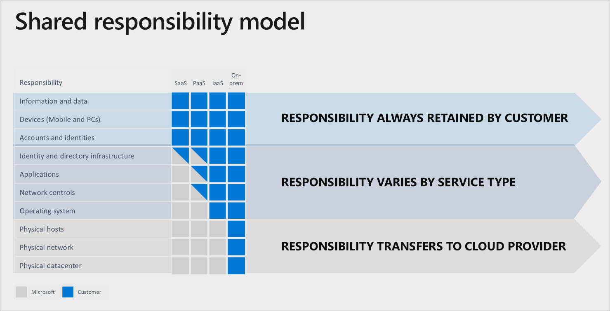

Title: Azure Cloud: Benefits and Categories
Date: 2018-03-29
Category: Cloud
Slug: azure_cloud_benefits_and_categories
Summary: Azure Cloud Concepts
Status: draft

 

### Types of Cloud Computing

* Public
	* anyone can sign up for it
	* azure owns the HW on their network and infrastructure ; you are leasing services
	* an organisation can decommission their on-prem data centre when all of their services are in the public cloud
  
* Private: 
	* you use your own datacentre, HW, upfront capital expenditure (CapEx)
	* you can license software from the Azure Stack, install on your own hardware
	* you can use a portal, create VMS etc just like you do with the public cloud
	* You own the HW etc but you use the services of the public cloud thus getting benefits of flexibility, agility and elasticity 
	* You don’t get the cost savings by just stopping to run sth   
	* can be rolled out to select users
  
* Hybrid: 
	* greatest degree of flexibility
	* minimises both CapEx and OpEx
	* on-prem plus additional resources in the cloud
	* extending, or scaling, private infrastructure to the cloud
    * most common use: cloud migration and high availability
	
 

### Benefits of Cloud Services

* Economies of Scale
* High availability: available for long periods of time
* Scalability vs. Elasticity
	* Scalability: increase/decrease workload on current resources
	* Elasticity: 
        * quickly provisioning cloud resources        
        * increase/decrease the number of resources e.g. adding/removing VMs
        * quickly expand or decrease computer processing, memory, and storage resources to meet changing demands wo/worrying about capacity planning for peak usage
* Agility
	* Quickly respond to changes
	* Provision or decommission cloud services in minutes using self-service
* Disaster recovery
	* Resiliency: ability to recover from a failure e.g. backups for VMs or SQL databases
* Cost Effective
	* OpEx vs. CapEx model
	* Capital Expenses (CapEx) are predictable upfront costs 
	* Operational Expenses (OpEx) are ongoing billing costs (pay as you go) and can be deducted from your taxes immediately.
	* Operational Expenses (OpEx) suited to agile environments where demand is unpredictable
* Consumption-based model
	* Paying for something based on how much you used, as opposed to paying for something no matter if you use it or not. 

 

### Categories of Cloud Services

#### IaaS

* examples: 
	* VM’s, Load Balancer, Firewall (aka Application Gateway), Virtual Network, VPN, subnets
	* Azure Storage
* emulation of a real piece of HW that you can buy in a store 
* 1-to-1 mapping/moving of what you have on-premises, e.g. pieces of hardware, to the cloud
* does NOT include SW services e.g. DB's
* You control the HW, choice of datacentre, availability zone, nbr of CPU’s
* You are responsible for upgrades, patches, version numbers	
  
#### PaaS aka *Web Apps* or *App Services* 

* Scaling is your responsibility
* PaaS can integrate with other services
	* e.g. with servlerless Azure SQL Database or Cosmos DB
	* e.g. with *Machine Learning Studio*
* It’s a platform that you need to build upon to be useful
* Development effort is required to turn it into sth useful
* You pay by the hour even if no one visits your App or website
* Cloud provider is more involved in this paradigm
* You compile code/program, upload it and cloud provider runs that code
* not picking out specific pieces of HW, not setting up networks; no choices over the HW
* You do have to choose tiers, and plan levels within the tiers e.g. App Service plan
	* Note that an App Service plan is similar to a traditional server farm 
	i.e. an **App Service plan is the set of compute resources needed for a web app to run**
	
* You pay for performance: the pricing tiers
* it is programmable so that you can upload your own code (App Service) 

#### SaaS

* examples: Dropbox, backup services, Google Drive, Google Docs, Office 365, Outlook, Active Directory, CRM tool, any enterprise App, 
* Anything where you use a web browser to access a service
* Access to configuration of existing product only; no access to code
* Don’t control servers; only control data and settings
* The product is useful stand alone 

#### Serverless 

* Autos-caling
	* Cloud provider is responsible for scaling e.g. adding servers or CPU’s as they are needed
* Consumption-based billing
	* you might pay nothing if you don’t use the service i.e. no one ever visits your App
* Azure serverless services:
	* Azure functions (compute)
	* Serverless Kubernetes (compute)
	* Azure SQL Database 
	* Cosmos DB 
* no access to server ; don’t know how many servers or processors are running your code
* no control over performance expectations (as opposed to performance via plans and tiers in PaaS)
* You only pay for execution and not for reservation
* You pay for CPU and data utilisation, NOT visits

 
                  
#### Shared Responsibility model

