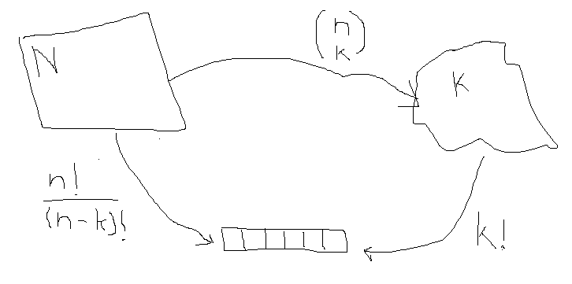

Title: Combinatorics I
Date: 2017-10-03
ategory: Combinatorics I
Slug: Combinatorics I
Summary: Combinatorics I
Status: draft

* Permutations w/replacement: $P^n_r = n^r$  
    - Nbr of pairs (i.e. permutations of 2) out of the set $\{0,1\}$ w/repl.: $P^2_2=2^2=4$ i.e. (0,0), (0,1), (1,0), (1,1)
* Permutations wo/replacement: $P^n_r = \frac{n!}{(n-r)!}$
* Combinations: $C^n_r = \frac{n!}{r!(n-r)!}$
    - Nbr of pairs (i.e. combinations of 2) out of 4 cards (i.e. from a set $\{1,2,3,4\}$): $C^4_2 = \frac{4!}{2!2!}=6$

 

Notes taken from Lecture 4 from the MIT video series [Probabilistic Systems Analysis and Applied Probability](https://ocw.mit.edu/courses/electrical-engineering-and-computer-science/6-041-probabilistic-systems-analysis-and-applied-probability-fall-2010/video-lectures/)
 
---

* How many license plates of 3 letters and 4 digits? $$26 \times 26 \times 26 \times 10 \times 10 \times 10 \times 10$$
* same as above wo/repl.: $$26 \times 25 \times 24 \times 10 \times 9 \times 8 \times 7$$ 
* The number of ways that one can order n objects
    - Given a set of n elements, how many possible sequences, i.e. permutations? $$n \times (n-1) \times (n-2) \ \times ... \times \ 1 = n!$$ 
* Number of possible subsets
    - Given n elements, how many possible subsets are there?   
    
        2 choices (add/don't add to subset) for element 1
        
        2 choices (add/don't add to subset) for element 2
        
        ...
        
        Overall there are $2^n$ choices
        
        >> **The number of subsets of an n element set is $2^n$**  

        Note: if n=1 then we have two possible subsets: {1} and $\varnothing$
        
---
#### Probabilities

P = # of possible events divided by overall sample space i.e. $\frac{|A|}{|\Omega|}$
        
* Given 6 dice rolls, what is P of all rolls giving different numbers?

    |A| = permutations of numbers 1 to 6 = 6!

    $|\Omega|$ = 6 for the first roll, 6 for the second roll, etc. i.e. $6^6$
    
    Answer: $\frac{6!}{6^6}$
    
* *n choose k*: Given a set of n elements, find subsets that have exactly k elements.
For example, given a group of 10 people, find the number of possible 5 people committees.

  $$\binom{n}{k} = \frac{n!}{k!((n-k)!}$$
  
  **Proof**

  
    
  n choices for person 1
    
  n-1 choices for person 2
    
  ...
    
  n-k+1 choices for person 5
  
  Thus one possible answer is $\frac{n!}{(n-k)!}$
    
  Now consider that, as shown above, $\frac{n!}{(n-k)!} = \binom{n}{k}k!$
  
  Thus, $\binom{n}{k} = \frac{n!}{k!((n-k)!}$
  
  Note that if we sum all possible k subsets, i.e. $\sum^n_{k=0} \binom{n}{k}$, we count all possible subsets 
  which equals the total number of subsets $2^n$.     
