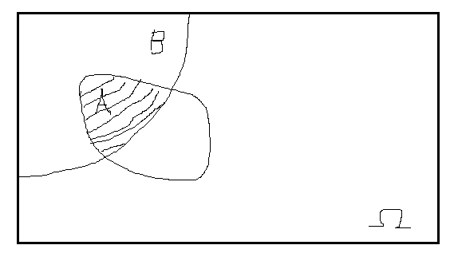

Title: Combinatorics II
Date: 2017-10-03
Category: Combinatorics II
Slug: Combinatorics II
Summary: Combinatorics II
Status: draft

 

Notes taken from Lecture 4 from the MIT video series [Probabilistic Systems Analysis and Applied Probability](https://ocw.mit.edu/courses/electrical-engineering-and-computer-science/6-041-probabilistic-systems-analysis-and-applied-probability-fall-2010/video-lectures/)
         
---
#### 6 Independent Coin Tosses

* Probability of a particular sequence:

  $$P(seq) = P^{\# \ Heads} \cdot {(1-P)}^{\# \ Tails}$$

    
  $$P(HTTHHH) = P \cdot (1-P) \cdot (1-P) \cdot P \cdot P \cdot P \\ 
              = P^4 \cdot {(1-P)}^2$$

* Probability of a sequence with k Heads

  >> is the sum of individual probabilities that given event can occur

  $$P(k{-}Heads) = \sum_{k-Head \ seqs} P(seq.)$$

  >> So we just need to figure out how many k-Head sequences there are, then multiply by $P^k  \cdot {(1-P)}^{Pn-k}$.
  
  >> So, how many outcomes are there in which we have exactly k Heads?
  
  >> \# k-Head seqs. = \# k-element subsets of set {1, ..., n} = $\binom{n}{k}$
  
  >> $\Rightarrow P(k{-}Heads) = \binom{n}{k} \ P^k \ {(1-P)}^{n-k}$
  
  >> this also referred to as *Binomial Probablitites*.
  
  >> Note that $\sum^n_{k=0} \binom{n}{k} \ P^k \ {(1-P)}^{n-k} = 1$ as we sum all P's for  for zero heads, 
  one head, ..., n heads.
  
  
#### Flip Coin 10 Times

Event B: 3 out of 10 were Heads

Event A: given that B occurred, what is the **conditional probablity** that the first 2 tossed were Heads?

* Inside Event B all outcomes are equally likely e.g. $P^3 \ {(1-P)}^7$
* The outcomes are the sequences that have exactly 3 Heads
* \# outcomes in B = \# of 3-Head seqs. when you toss 10 times = $\binom{10}{3}$

Given that B occurred, how many elements are there in A?

>> $\Rightarrow$ out of the outcomes with 3 Heads (event B), how many start with HH (event A)?

>> $\Rightarrow$ if slot 1 and slot 2 is Heads, then there are 8 possibilities for the third Head

>> Recall that, in general, P = # of possible events divided by overall sample space i.e. $\frac{|A|}{|\Omega|}$

>> $\Rightarrow \frac{|A \cap B|}{|B|} = \frac{8}{\binom{10}{3}}$
  
  
  
  
  
  

