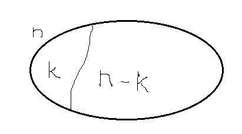
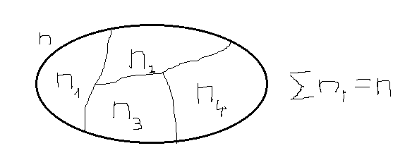

Title: Combinatorics III
Date: 2017-10-03
Category: Combinatorics III
Slug: Combinatorics III
Summary: Combinatorics III
Status: draft

 

Notes taken from Lecture 4 from the MIT video series [Probabilistic Systems Analysis and Applied Probability](https://ocw.mit.edu/courses/electrical-engineering-and-computer-science/6-041-probabilistic-systems-analysis-and-applied-probability-fall-2010/video-lectures/)
         
---
### More about n choose k

*The business of n choose k has to do with starting with a set and picking a subset of k elements.*

Another way of thinking about it: picking a subset is the same as partitioning the set into 2 pieces:

Counting partitions in general:

In how many ways can we do this partitioning?

*n choose k* is the answer when we partition into 2 pieces...but how de we generalise this?

#### Example: How many hands are there in which every player has exactly one Ace?

* 52 cards deck
* deal: 13 cards to each player
* partition deck into 4 hands i.e. 4 subsets of 13 each
* assuming they are equally likely
* it doesn't matter in which order you get them, only which subset you get
* Event A: every player has exactly one Ace

Step 1: Cardinality of sample space $\Omega$ 

How many possible hands are there for each hand ?

Hand 1: $\Rightarrow \binom{52}{13} = \frac{52!}{13!39!}$

Hand 2: $\Rightarrow \binom{52-13}{13} = \frac{39!}{13!26!}$

Hand 3: $\Rightarrow \binom{39-13}{13} = \frac{26!}{13!13!}$

Hand 4: $\Rightarrow \binom{26-13}{13} = \frac{13!}{13!}=1$

After cancellations we have $\frac{52!}{13!13!13!13!} = \frac{n!}{n1!n2!n3!n4!}$

Step 2: Event A

$\Rightarrow$ Take the 4 Aces and distribute them randomly to each player.

* Ace 1 -> 4 choices
* Ace 2 -> 3 choices
* Ace 3 -> 4 choices
* Ace 4 -> 1 choices

This is the same as paritioning a set of 4 elements into 4 subsets when each subset has 1 element:
$\frac{4!}{1! \ 1! \ 1! \ 1!} = 4!$

Now, distributing the remaining cards...: 

48 cards given to 4 players w/12 each gives us $\frac{48!}{12!12!12!12!}$

Putting it all together:

$\frac{event A}{\Omega} = \frac{4!\frac{48!}{12!12!12!12!}}{\frac{52!}{13!13!13!13!}}$

  
  
  
  
  
  

