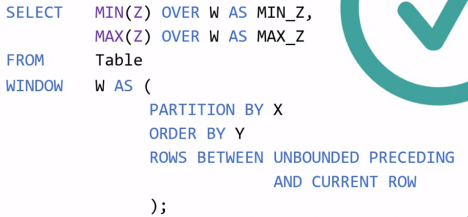
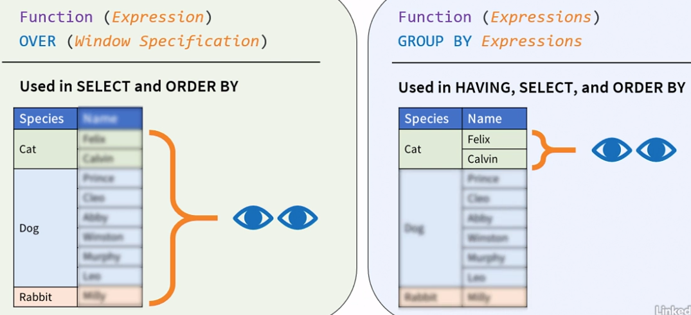
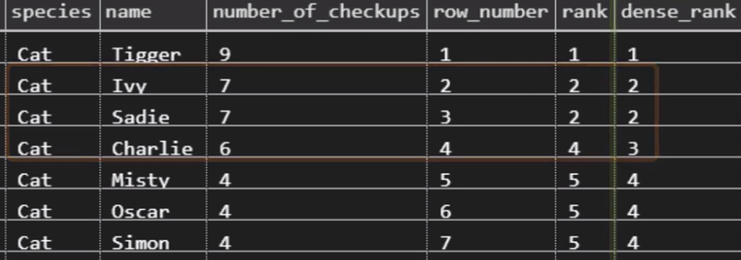

Title: SQL
Date: 2017-11-19
Category: Databases
Slug: sql
Summary: SQL


### Advanced SQL – Window Functions (LinkedIn Learning)

#### Blank OVER()

* Blank OVER() clause will make the window consider the whole set


#### Filtering data

* when using a subquery in a SELECT statement, and the sub-query contains a WHERE clause, then the WHERE clause must be duplicated in the main query (see 2.2 3:25)
* with WINDOW functions, it's enough to filter in the main query WHERE clause, and that data is all that the WINDOW funtions sees!

#### Non-correlated Subquery Example

* Example of non-correlated subquery i.e. which will be executed only once - see 2.3 3:20

#### Dual Purpose of ORDER BY clause 

* see 2.3 3:45
* Aggregate and frame offset window functions are inherently order agnostic. For these, ORDER BY is used for defining frames that further limit the rows visible to the function 
* For rank, row offset, and distribution window functions, ORDER BY defines how the function is evaluated.
  
#### Framing Rows and Ranging

* UNBOUNDED PRECEDING, UNBOUNDED FOLLOWING, CURRENT ROW, 1 PRECEDING, 1 FOLLOWING etc
* can be applied to ROWS, RANGES and GROUPS

* ROWS frame boundaries are specified using row position count
	* e.g. one row, 20 row, or all the rows that either precede or follow the current one
	* Row frames don't care what values are in these rows, they just count rows
	* N PRECEDING and N FOLLOWING, point to any number of rows before or after the current one

* RANGE frames are specified using value ranges that either precede or follow the current row 
	* regardless of how many rows they cover
	* RANGE frames are data type dependent. 
	* Example: an integer range of 10 represents all rows that have a sorting value which is plus or minus 10 from the current rows value
	* Value, NOT position
	* CUREENT ROW for RANGE frames doesn't refer to the current row's position like it did with the ROWS frame. 
	* For RANGE, it refers to the current row's value, and that includes all rows that share the same value. 

* GROUPS frames are defined using the number of peer groups following or preceding the current row's group. - see 3.1 05:51
	* A peer group is a set of rows that share the same sorting values. 
	* So when evaluated for the second row in this partition, a group frame that begins with one PRECEDING and ends with one FOLLOWING, will cover all partition rows 
	
#### The Window Clause



#### Windows vs Group Aggregate Functions

* Aggregate Window Functions are defined with the OVER clause. 
  * They see all the rows or row groups as defined by their window specification. 
  * They don't see individual rows within each row group. 
* Aggregate Grouped Functions 
  * can be used in the HAVING, SELECT, and ORDER BY clauses. 
  * They see individual rows within each group, but they can't see any row groups other than their own
  



#### RANK Window Functions

* ORDER BY determines the basis for the rank and is mandatory. 
* a rank of an expression is always relative to others within its partition
* Framing doesn't make sense for Rank functions

#### RANK vs DENSE_RANK



#### Ntile

* Ntile segments a partition into as equal as possible n or less segments. 
* Each segment is called a tile. Ntile assigns each row an integer number out of a monotonically increasing sequence
  starting with one and ending either at N or the number of rows within the partition in case there are fewer of those.


### Some Sample Queries

```
SELECT train, dest, time FROM ( 
  SELECT train, dest, time, 
    RANK() OVER (PARTITION BY train ORDER BY time DESC) dest_rank
    FROM traintable
  ) where dest_rank = 1
```

<br>


```
select * from PREDICATION where SUBJECT_SEMTYPE in ('gngm') limit 10;
select * from ENTITY where SEMTYPE in ('gngm') and GENE_ID <> '' limit 10;
```
<br>

```
select count([Incident Type]), [Incident Type]
FROM [dbo].[bat_2020]
Group by [Incident Type]
```

<br>

```
SELECT MIN ([Created Date Time]) AS "Min Date" ,
       MAX ([Created Date Time]) AS "Max Date"  
FROM [dbo].[bat_2020]
```

### Useful commands

#### Determine table column size

```
Select        max(len([number])) as [number]
              ,max(len([u_opened_date])) as [u_opened_date]
              ...
from   dbo.mytable
```

#### Insert from another table

To get the table details

`show create table ENTITY;` 

To create the new ENTITY2 table, copy/paste from the above output.
  
`insert into ENTITY2 select * from ENTITY where GENE_ID <> '';`


#### See table columns and their data types

```
SELECT DATA_TYPE FROM INFORMATION_SCHEMA.COLUMNS 
  WHERE table_name = 'tbl_name' AND COLUMN_NAME = 'col_name';
```

#### Create DB

```
GRANT ALL PRIVILEGES ON *.* TO 'root'@'localhost' IDENTIFIED BY 'root';
CREATE DATABASE dbname;
USE dbname;
```

#### Import from sql.gz file

```python
sudo apt-get install pv
zcat filename.sql.gz | pv -cN zcat | mysql -u root -p -f -D dbname ;
```

#### Get stats

```python 
SELECT table_schema "dbname",
        ROUND(SUM(data_length + index_length) / 1024 / 1024, 1) "DB Size in MB" 
FROM information_schema.tables 
GROUP BY table_schema; 
```

or (requires mysql v5.7+)

```
select table_schema, table_name, rows_fetched, rows_inserted, rows_updated, rows_deleted 
    from sys.schema_table_statistics where table_schema='dbname';
```

or

`SHOW TABLE STATUS dbname;`


#### Logging

* start logging: `tee ./mylofile.log`
* stop logging: `notee`


#### Where is the table data stored?

* it is specified in `my.cnf`
* otherwise, the default location is `/var/lib/mysql/`

#### Partition

```python
alter table ENTITY partition by range(ENTITY_ID)(
partition p0 values less than (250000000),
partition p1 values less than (500000000),
partition p2 values less than (750000000),
partition p3 values less than maxvalue
);
```

#### Set Primary Key

```ALTER TABLE table_name ADD PRIMARY KEY (column_1, column_2);```

#### Drop foreign key

```python
ALTER TABLE ENTITY DROP FOREIGN KEY 'ENTITY_ibfk_1';
Note: would this be better??
    ALTER TABLE foo DISABLE KEYS;
    do stuff
    ALTER TABLE ENABLE KEYS;
```


#### Increase buffer size for large import

    $ sudo nano /etc/my.cnf
    [mysqld] innodb_buffer_pool_size=228G

#### Error with MySQL: "The total number of locks exceeds the lock table size"
* [see here](https://dba.stackexchange.com/questions/27328/how-large-should-be-mysql-innodb-buffer-pool-size)


#### Misc. Mysql

* `$ mysql -u root -p`
* `$ sudo service mysql restart`
* `SHOW ENGINE INNODB STATUS;`
* `show table status like 'ENTITY'\G;` # number of rows in table
* `SELECT ENTITY_ID, COUNT(*) c FROM ENTITY_GENE GROUP BY ENTITY_ID HAVING c > 1;` # find duplicates


#### Install MySQL

* [see here](https://askubuntu.com/questions/750498/mysql-5-5-update-to-mysql-5-7)
and [here](https://www.digitalocean.com/community/tutorials/how-to-install-mysql-on-ubuntu-14-04)

#### Resources

* [Ten SQL Concepts ](https://towardsdatascience.com/ten-sql-concepts-you-should-know-for-data-science-interviews-7acf3e428185)
* [pysqlplus](https://github.com/jamescalam/pysqlplus)
* [How to change column datatype in SQL](https://stackoverflow.com/questions/5136013/how-to-change-column-datatype-in-sql-database-without-losing-data/5136055)
* [SQL Fiddle](http://www.sqlfiddle.com/#!2/599d0/1)
* [How to manage MySQL databases and users from the command line](https://www.a2hosting.com/kb/developer-corner/mysql/managing-mysql-databases-and-users-from-the-command-line)
* [Install and Configure MySQL Workbench on Ubuntu 16.04](https://www.linode.com/docs/databases/mysql/install-and-configure-mysql-workbench-on-ubuntu/)
* [MySQL Partitioning](https://www.youtube.com/watch?v=iUjoPB27-iA)
  
